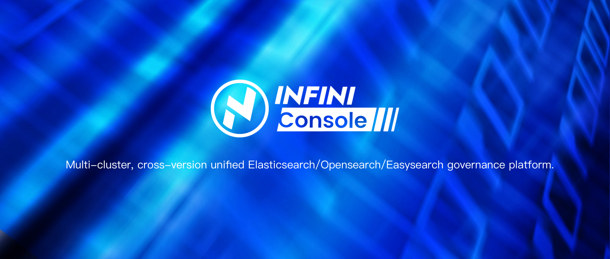

IK Analysis for Elasticsearch and OpenSearch
==================================



INFINI Console is Multi-cluster, corss-version unified Elasticsearch/OpenSearch/Easysearch governance platform.

## Backend Development Guide

```sh
make build
cd bin
./console
```

Setup wizard please vistor https://docs.infinilabs.com/console/main/docs/reference/setup/

## Frontend Development Guide

The frontend is developed using React and outputs pure static resources into the `.public` directory. These resources can be deployed independently without relying on a Node environment.

### Local Development Environment Setup

Ensure you have Node.js (version 16.17 ) installed:

```sh
node -v
npm -v
```

you can install cnpm for a faster and more reliable package management experience. Use the following command to install it:

```sh
# clone console-ui
git clone https://github.com/infinilabs/console-ui.git
# clone common-ui
cd src
git clone https://github.com/infinilabs/common-ui.git common
# install cnpm@9.2.0
npm install -g cnpm@9.2.0 --registry=https://registry.npm.taobao.org
```
### Download Project Dependencies

```sh
# install dependencies
cnpm install
```

### Start Development Mode

```sh
cnpm run dev
```

### Compile Static Resources

```sh
cnpm run build
```

Running this command will generate the final HTML, CSS, and JS files in the `.public` directory. These are browser-ready files that can be deployed to your desired server.

### Useful Links for Frontend Development

- Current UI components used: https://3x.ant.design/components/button/
- ProComponents: https://procomponents.ant.design/
- Chart components: https://charts.ant.design/guide
- Ant Design Pro Preview: https://preview.pro.ant.design

