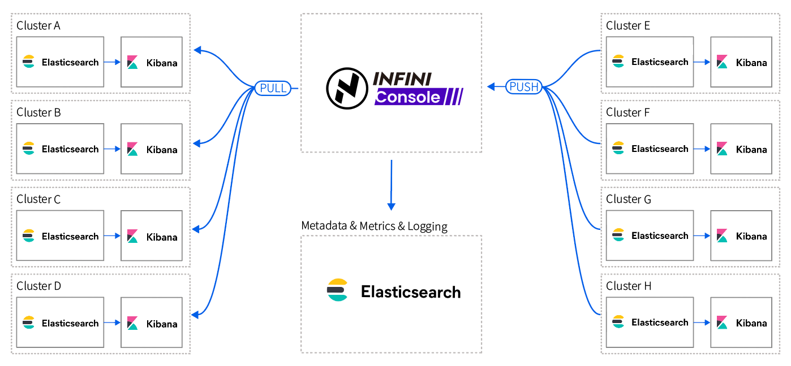

INFINI Console
==================================


**INFINI Console** is a very lightweight multi-cluster, cross-version unified Elasticsearch governance platform. Through the centralized management of Elasticsearch, you can quickly and conveniently manage multiple sets of Elasticsearch clusters within the enterprise.

## Architecture



## Features

> INFINI Console is powerful, lightweight, and very easy to use.

- Support multi-cluster management, you can manage any number of clusters at the same time in one platform;
- Multi-version Elasticsearch support, support 1.x, 2.x, 5.x, 6.x, 7.x, 8.x;
- Supports grouping and managing cluster metadata information on a project-by-project basis, support custom tags;
- Support dynamic clusters registration, and the target cluster can be accessed and managed on the fly;
- Supports viewing the historical version of cluster metadata, and can view the changes and audits of cluster metadata.
- Developer tools support multiple workspaces to switch quickly, support smart suggestion, frequent used commands support to save and load;
- Supports unified multi-cluster level index and API interface granularity permission control;
- Supports a unified alerting engine across clusters and flexibly configure alarm rules based on thresholds;
- Support unified monitoring of any version, including cluster, node, index and other very detailed dimensions of the metrics viewing and analysis;
- Support common management operations of indices, support quick viewing and browsing of indices, and support updates and deletes of documents in the index;
- Support the creation of indexed data views, you can modify the display format of fields, and support the quick viewing of time series index data;
- Support for cross-platform deployment environments, support for MacOS (Intel and M1), Windows (32-bit and 64-bit), Linux (32-bit and 64-bit);
- Support x86, arm5, arm6, arm7, mips, mipsle, mips64 and other CPU architectures:
- Support for Docker containers and K8s cloud-native environments;
- Support for the management of INFINI gateways;

INFINI Console is written in Golang, the installation package is very small, only about 11MB, there is no external environment dependency, deployment and installation are very simple, just need to download the binary executable file of the corresponding platform, start the application and then you are good to go.

To learn more about Console, please visit: https://docs.infinilabs.com/console/


## Quickstart

- Build [web](web/README.md) before you run INFINI Console.
  
```sh
# init code base path
mkdir -p $HOME/go/src/infini.sh && cd $_
# build console
make build
cd bin && mkdir -p config && cp -rf ../config/{setup,*.tpl,*.json} .
# run console
./console
```

## Community

Fell free to join the Discord server to discuss anything around this project:

[https://discord.gg/4tKTMkkvVX](https://discord.gg/4tKTMkkvVX)

## License

INFINI Gateway is a truly open-source project, licensed under the [GNU Affero General Public License v3.0](https://opensource.org/licenses/AGPL-3.0).
We also offer a commercially supported, enterprise-ready version of the software.
For more details, please refer to our [license information](./LICENSE).
